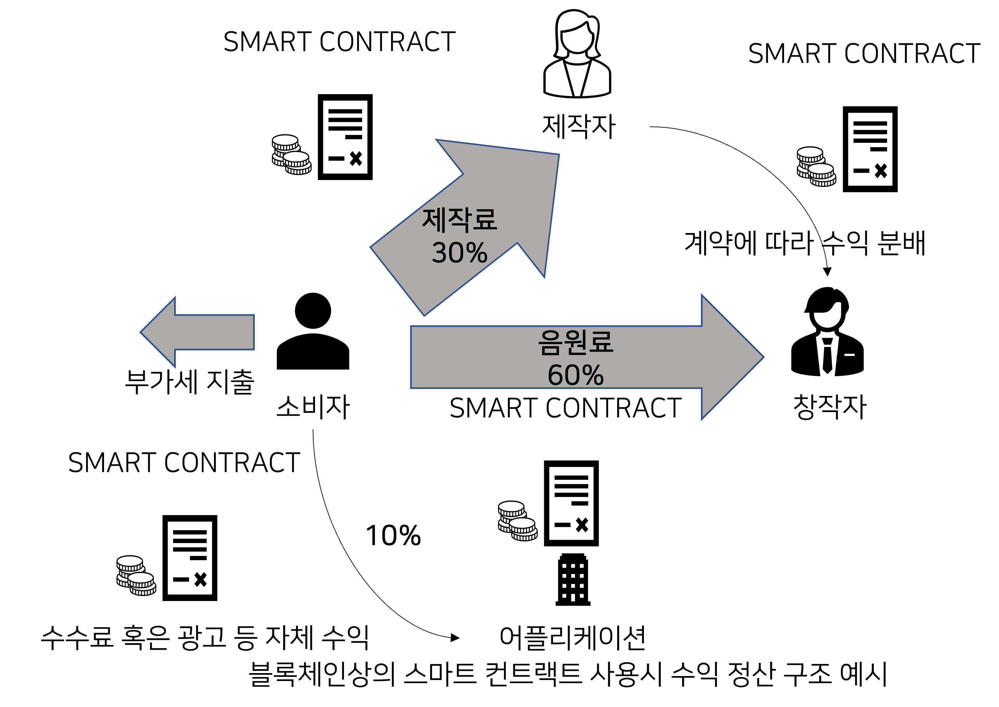

# klaytn music

# :books: 목차

- [:book: Project Introduction](#book-Project Introduction)

  - [Project Overview](#Project-Overview)
  - [Project Summary](#Project-Summary)
  - [Project Flowchart](#Project-Flowchart)
  <!-- - [DB Schema](#db-Schema) -->

- [:wrench: 사용 기술 (Technique)](#wrench-사용-기술-technique)

  - [:hammer:기술 스택 (Technique Used)](#기술-스택-technique-used)

    - [**FrontEnd**](#frontend)
    - [**BackEnd**](#backend)
    - [**Smart Contract**](#smart-contract)
    <!-- - [**Deploy**](#deploy) -->

    <!-- - [Deploy :rocket:](#deploy-rocket) -->
    <!-- - [Connect](#connect) -->

- [:computer: Service (Service)](#computer-Service-service)
- [:Project Review](#Project Review)


# :book: Project Introduction

## Project Overview

기존 음원서비스의 정산 시스템의 속도가 가상화폐를 사용하여 정산하는 속도보다 느리다.

※ 음원 다운로드 혹은 스트리밍 방식에 의한 수익 산정 방법은 명시되어 있으나 언제 수익이 정산되는지 사용자가 알 수가 없다.

- 음원차트의 경우 특정 플랫폼이 사용자 음원 재생 정보를 독점하기 때문에 사용자는 자세한 정보를 알 수 없다.

  이러한 단점을 해결하기 위해 만든 프로젝트 입니다.
  

## Project Summary

기존 음원 스트리밍 서비스보다 블록체인의 스마트 컨트랙트를 통한 신뢰성 있는 음원차트기능 생성

음원 스트리밍에 적용할 수 있는 스마트 컨트랙트를 통한 ERC-20표준 가상화폐 발행

기존 음원 스트리밍 서비스보다 스마트 컨트랙트의 가상화폐를 통한 빠른 음원 스트리밍 비용 정산 시스템 구축

## Project Flowchart



# :wrench: 사용 기술 (Technique)

### FrontEnd

|                         Icon                         | Stack | Description     |
| :--------------------------------------------------: | :---: | --------------- |
|  | REACT | Frontend Development |

### BackEnd

|                          Icon                          |  Stack  | Description        |
| :----------------------------------------------------: | :-----: | ------------------ |
|   | NODEJS  | Creating API Server |
|  | MONGODB | Using MongoDB Atlas |
|    |  NGINX  | Used as Web Server |

### Smart Contract

|                          Icon                           |  Stack   | Description          |
| :-----------------------------------------------------: | :------: | -------------------- |
|  | SOLIDITY | Writing Smart Contracts|
|   | TRUFFLE  | Deploying Smart Contracts |
|    |  KLAYTN  | Blockchain Network |
|   | GANACHE  | Local Testing |

<!-- ### Deploy

|                               Icon                                |        Stack        | Description                        |
| :---------------------------------------------------------------: | :-----------------: | ---------------------------------- |
|         |       DOCKER        | Container creation, image generation for deployment |
|            |         EC2         | Deployment server                  |
|        |      ROUTE 53       | Connecting DNS with EC2 server     |
|            | CERTIFICATE MANAGER | SSL certificate generation         |
|  |   GITHUB ACTIONS    | Utilizing CI/CD for automated deployment            | -->

<!-- ## :construction:Architecture

## 1. FE .env 설정 -->

# :computer: SERVICE (Service)

<div>
<!-- HOME -->


<!-- MUSIC UPLOAD -->

</div>
<div>
<!-- MYPAGE -->


<!-- MUSIC LIST -->

</div>

## MUSIC PLAY SmartContract

```solidity
// 예시 솔리디티 코드
pragma solidity ^0.8.0;

interface PlayCounter{

struct tokenInfo{
        uint256 listenCount;
        uint256 tokenId;
        address owner;

    }

    function listen(uint256 _tokenId) external ;
}

//ERC721 NFT 발행을 위한 ArtGrowNFT.sol
//음원정산을 위한 ERC20토큰 발행 Amaranthus.sol 의 interface이다.

    function safeMint(address to, string memory uri) public  {
        uint256 tokenId = _tokenIdCounter.current();
        _tokenIdCounter.increment();
        _safeMint(to, tokenId);
        _setTokenURI(tokenId, uri);

        PlayCounter.tokenInfo memory newtokenInfo = PlayCounter.tokenInfo({
            listenCount:0,
            tokenId:tokenId,
            owner:msg.sender
        });
     _tokenInfoList[tokenId]= newtokenInfo;
    }

    // The following functions are overrides required by Solidity.

    function listen(uint256 _tokenId) external{
        _tokenInfoList[_tokenId].listenCount+=1;
    }

// Logic for issuing NFTs in ArtGrowNFT.sol, aiming to reflect user preferences regarding music.
```


```solidity
// 예시 솔리디티 코드
pragma solidity ^0.8.0;


contract Amaranthus is ERC20{
        using Counters for Counters.Counter;

    Counters.Counter private _playerCounter;

   using SafeMath for uint256;
   using SafeERC20 for IERC20;

    uint256 private MAX_TOKEN_COUNT = 20000000000;   // 총 코인 개수
    constructor() ERC20("Amaranthus", "AAS") {
        // Mint 100 tokens to msg.sender
        // Similar to how
        // 1 dollar = 100 cents
        // 1 token = 1 * (10 ** decimals)
        _mint(msg.sender, MAX_TOKEN_COUNT * 10**uint(decimals()));
    }

    mapping(address => uint256) private lockedUntil;

    function getLockedUntil(address account) external view returns (uint256) {
        return lockedUntil[account];
    }

    function sendTransaction(address to, uint256 value,address _counter,uint256 _tokenId) external {
        require(block.timestamp >= lockedUntil[msg.sender], "Transaction is locked.");
        // Lock the sender's account for 4 minutes
        lockedUntil[msg.sender] = block.timestamp + 240;
        // Send the transaction
        transfer(to,value);
        PlayCounter(_counter).listen(_tokenId);
    }
}


// Part of Amaranthus.sol where the sendTransaction function is used when a user plays a song,
// transferring the previously issued ERC20 tokens to the music creator. A transaction lock of 4 minutes is set
// to prevent indiscriminate transactions.
```
## 프로젝트 후기

### Technical Achievements
While previous projects communicated with the blockchain by connecting virtual wallets on the frontend, this project easily generated user wallet information through Kaytn Wallet and established a database to generate raw transactions. This enhanced accessibility without the need for separate user signatures as with walletConnectModal.

### Problem Solving
I realized the importance of system architecture design in the communication process between the backend and frontend. Especially when deploying to AWS, a design that does not consider the cloud environment leads to significant time consumption.

###Limitations
The project still relies on IPFS for storing music files.

Issues with resolving GAS FEE when deploying actual contracts.

External communication issues with the private network built using GETH to replace Klaytn TESTNET.

I realized that it's difficult for a single individual to achieve perfection in a project, and teamwork with division of tasks is necessary.

